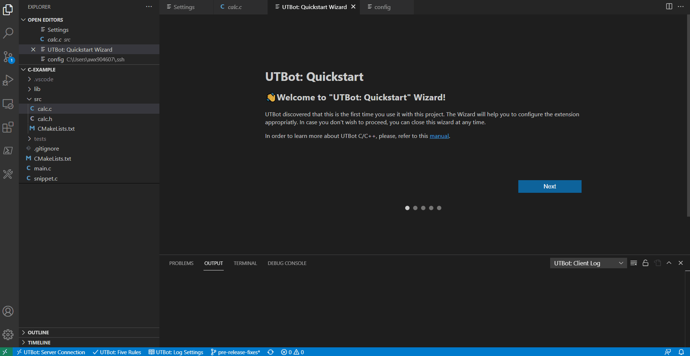

## How to build UTBotCpp from source

UTBot has many dependencies, so the easiest way to build the tool from source and develop it is to use the docker container.

UTBot has a published package called [base_env](https://github.com/UnitTestBot/UTBotCpp/pkgs/container/utbotcpp%2Fbase_env). 
It contains all the needed dependencies such as Git, LLVM, GRPC, GoogleTest and so on. **base_env** has multiple versions tagged with dates.
If you are developing the tool, you are most likely to need the most recent version.

To build UTBot from sources:
1. Install [docker](https://docs.docker.com/engine/install/ubuntu/)
2. Run the command  
   ```
   docker plugin install lebokus/bindfs
   ```
3. Run `utbot_docker_dev.sh` script. It will unpack the docker image and mount UTBot sources inside it.
   UTBot binary can be built in the docker and run in it.
   The script will prompt you to enter an `ssh` port required to ssh into the container using `ssh utbot@host -p $port`, where `host` is docker host IP address (it may be `localhost`). Please, specify a port that is not taken by any process. Also, you will be prompted to enter a port where UTBot itself will be run.
4. Get access to the container via
   
  `ssh utbot@host -p $port` 

   If you are prompted a password, type in `utbot`.

5. `cd` into `UTBotCpp` directory and run `build.sh` — it is the script that builds KLEE UTBot and runs UTBot unit tests
6. Navigate to `UTBotCpp/server/build` directory and launch the binary with `./utbot server` command. Now the server is running.
7. Launch VS Code on your local machine. Use VS Code [Remote-SSH](https://code.visualstudio.com/docs/remote/ssh) to get access to the docker insides. Navigate to `UTBotCpp/vscode-plugin` directory and press F5. This will build and run UTBot VS Code plugin.
8. A new VS Code window will open; this window will have UTBot VS Code plugin enabled. In this new folder, open `UTBotCpp/integration-tests/c-example` directory.
9.  When UTBot Quickstart Wizard requests you to enter server host and port, specify `localhost` and UTBot server run port, respectively.
   
6.  Select project path as `/home/utbot/UTBotCpp/integration-tests/c-example`;
7.  You are now ready to experience UTBot capabilities! You can view possible commands in Command Palette (Press F1 and type in UTBot).

If you want to change UTBot test generation preferences, you can edit them in  File > Preferences > Settings > Extensions > UnitTestBot.
After UTBot configuration, you can select your source directories with the tab on the VSCode toolbar on the left. Then, you can generate tests with the use of Command Palette. Press **F1** and type in "UTBot": You will see tests generation options.

## How to develop UTBotCpp with an IDE

You can edit UTBot sources, rebuild and rerun the server with an IDE. Usually, CLion *Remote host* toolchain is used for it.

To setup it:
1. Open UTBotCpp project with CLion on your local machine.
2. Open **Settings > Build, Execution, Deployment > Toolchains**.
3. Add a new *Remote Host* toolchain.
4. In *Credentials* section, set up an `ssh` connection to the UTBot docker container you have. Consider enabling connection via OpehSSH authentification agent to ease files synchronization.
5. All other fields should fill in automatically.

